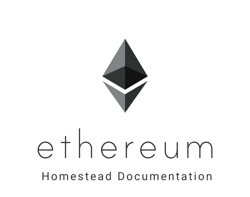

# 以太坊家园版文档

本文档是以太坊志愿者不断努力的结果。 虽然它没有得到基金会的授权，但我们希望你会觉得它有用。 我们欢迎新的贡献者。

## 内容

- [introduction/index](introduction/index.md)
- [ethereum-clients/index](ethereum-clients/index.md)
- [connecting-to-clients/index](connecting-to-clients/index.md)
- [account-management](account-management.md)
- [ether](ether.md)
- [network/index](network/index.md)
- [mining](mining.md)
- [contracts-and-transactions/index](contracts-and-transactions/index.md)
- [frequently-asked-questions/frequently-asked-questions](frequently-asked-questions/frequently-asked-questions.md)
- [glossary](glossary.md)
- [about](about.md)

## 改善文件

请参阅[本页](https://ethereum-homestead.readthedocs.org/en/latest/about.html)帮助我们改进文档。
